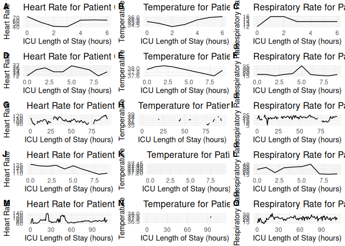

# A7

## Q3

## Date and Time 2023-07-16 08:24:54

## A table listing the patients who currently have sepsis (if any), along with their most recent heart rate, temperature, and respiratory rate

``` r
#| echo: FALSE
#| message: FALSE
#| warning: FALSE

# A table listing the patients who currently have sepsis (if any)
sepsis_patients <- most_recent_data %>%
  filter(SepsisLabel == 1) %>%
  select(PatientID, HR, Temp, Resp)

sepsis_patients
```

    # A tibble: 5 × 4
    # Groups:   PatientID [5]
      PatientID    HR  Temp  Resp
      <chr>     <dbl> <dbl> <dbl>
    1 001118       63  36.2    14
    2 004939       74  37.9    18
    3 005251      108  NA      23
    4 007540      110  37.2    17
    5 009651       82  NA      21

## Plots for all patients who have sepsis (if any) that show the complete history of their heart rate, temperature, and respiratory rate during their time in the ICU.



## A table showing the change in heart rate, temperature, and respiratory rate between the last two measurements for all patients

    # A tibble: 126 × 4
    # Groups:   PatientID [42]
       PatientID variable    change change_direction
       <chr>     <chr>        <dbl> <chr>           
     1 000102    HR_change        8 increased       
     2 000102    Temp_change     NA same            
     3 000102    Resp_change     NA same            
     4 000174    HR_change       10 increased       
     5 000174    Temp_change     NA same            
     6 000174    Resp_change     -4 decreased       
     7 000318    HR_change       -7 decreased       
     8 000318    Temp_change     NA same            
     9 000318    Resp_change     -4 decreased       
    10 000400    HR_change        2 increased       
    # ℹ 116 more rows
